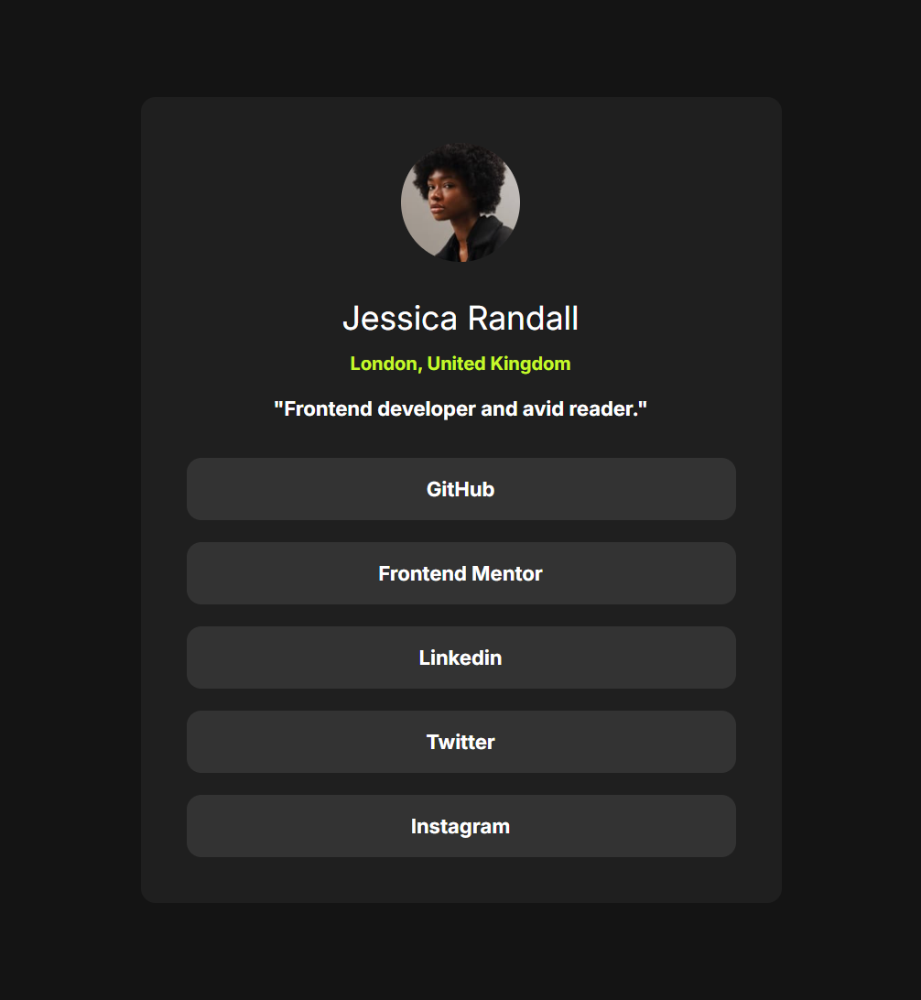

# Social Links Profile - Responsive Edition 📱💻

A modern, fully responsive social links profile card. This project is a solution to the [Social links profile challenge on Frontend Mentor](https://www.frontendmentor.io/challenges/social-links-profile-UG1OIYqB6c).

---

- **Live Demo:** [View Live Site](https://suhaibadill.github.io/social-links-profile/) 🚀

---

## 📸 Project Showcase

  
  
<i>A sleek profile card that adjusts perfectly from mobile to desktop screens.</i>

---

## 🛠 Features

- **Advanced Responsiveness:** Uses Media Queries to optimize the card size and typography for Mobile (<480px), Tablet (768px+), and Desktop (1024px+).
- **Flexbox Mastery:** Perfectly centered layout using CSS Flexbox for the container and card elements.
- **Modern CSS Color Formats:** Implemented high-precision colors using `oklch()` for maximum clarity.
- **Interactive UI:** Smooth hover states on social links for an enhanced user experience.

---

## 🏗 Built With

- **HTML5:** Clean and semantic structure.
- **CSS3:** Custom Media Queries, Flexbox, and Advanced Color Functions (`oklch`).
- **Google Fonts:** Inter (Weights: 400, 700).

---
